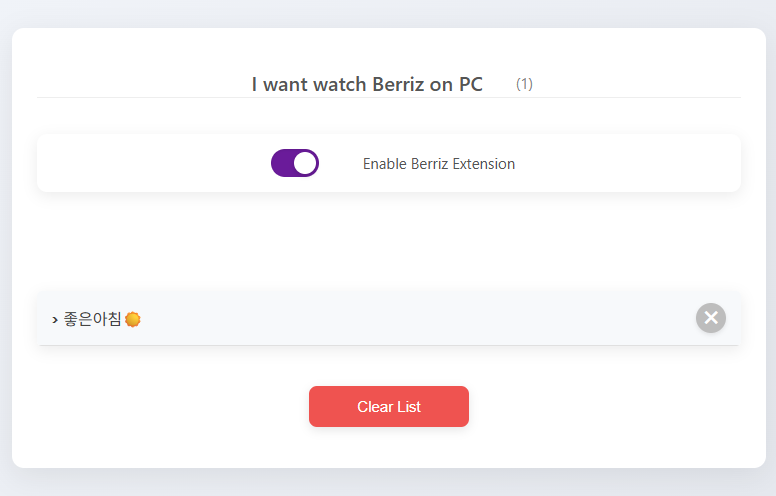
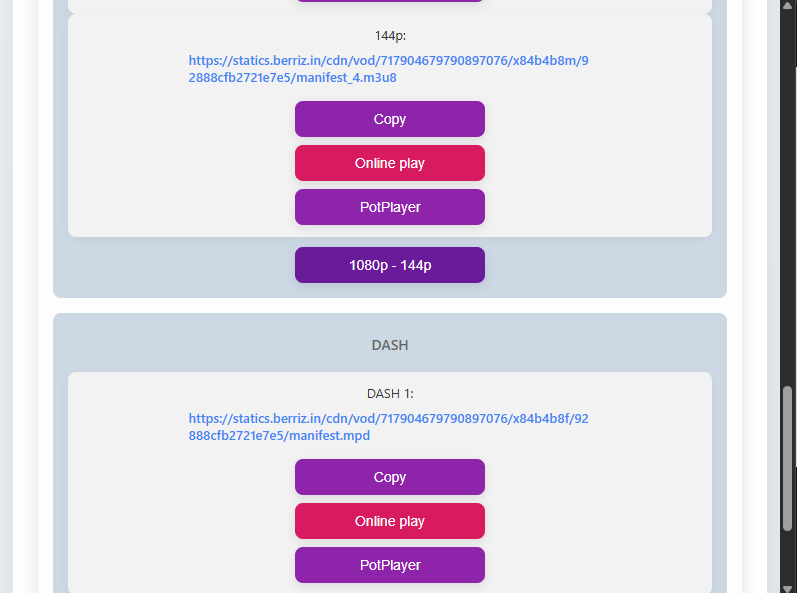
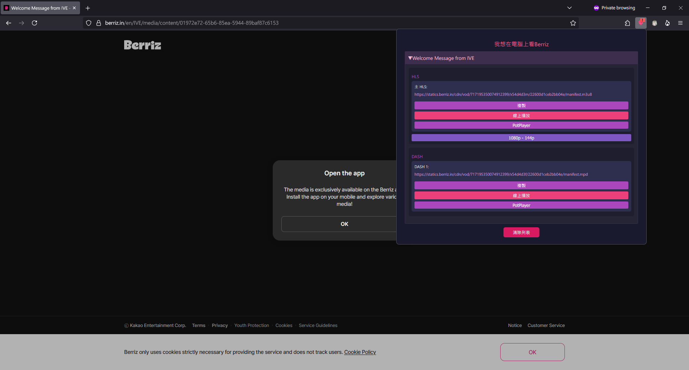
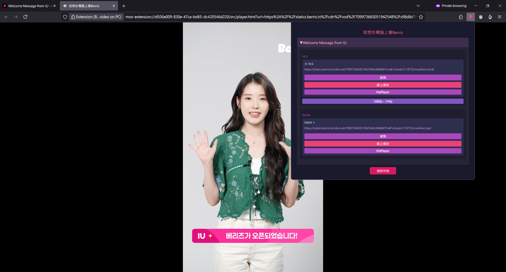

# Berriz-Media-Pass: Seamless Media Playback on Berriz

Berriz-Media-Pass is a browser extension designed to fix and enable media playback on PC for [Berriz](https://berriz.in). Whether you're using Chrome or Firefox, this extension ensures you can enjoy your favorite content without interruption.

---

## 🎬 Watch the Demo | 觀看示範影片

<iframe width="720" height="405" src="http://www.youtube.com/watch?v=_0-SOj9Z_U4"
        title="Berriz I want watch video on pc DEMO" frameborder="0"
        allow="accelerometer; autoplay; clipboard-write; encrypted-media; gyroscope; picture-in-picture; web-share"
        referrerpolicy="strict-origin-when-cross-origin" allowfullscreen>
</iframe>

---

## 📸 Demo Screenshots | 示範畫面

  

    
    
Chrome Popup Chrome 彈出視窗

  

  

    
    
Video Selection 影片列表

  

  

    
    
Firefox Screenshot (v1.2.3 Popup CSS Only) Firefox 截圖 (僅限 v1.2.3 彈窗樣式)

  

  

    
    
LIVE Player 播放介面

  

---

## 📦 Download

Ready to enhance your Berriz experience?

👉 [**Download from GitHub Releases (v1.0)**](https://github.com/twkenxtis/Berriz-Media-pass/releases/tag/v1.0) | **從 GitHub Releases 頁面下載 (v1.0)**

---

## 🔧 Installation Guide

### ✅ Chrome Users | Chrome 使用者

1.  **Download and Unzip:** Download the ZIP file from [Releases](https://github.com/twkenxtis/Berriz-Media-pass/releases) and extract its contents. | 從 [Releases](https://github.com/twkenxtis/Berriz-Media-pass/releases) 下載並解壓縮 ZIP 檔案。
2.  **Open Extensions Page:** Navigate to `chrome://extensions` in your browser. | 前往 `chrome://extensions`。
3.  **Enable Developer Mode:** Toggle on "Developer mode" in the top right corner. | 啟用「開發人員模式」。
4.  **Load Unpacked Extension:** Click **Load unpacked** and select the unzipped folder. | 點選 **Load unpacked**（載入已解壓的擴充功能），然後選取解壓後的資料夾。

---

## 🦊 Firefox Installation Guide

For the best Firefox installation experience, we recommend using the **Community Edition** or the **Official ESR Nightly version**. These versions do not enforce extension signing, allowing for direct ZIP file installation without temporary methods. We're also working to make our extension available on the Firefox Add-ons Marketplace soon!

---

### 🔹 Method 1: Direct ZIP File Installation | 方法一：直接通過 ZIP 檔案安裝

1.  **Download the ZIP file:** Get the latest version from the [Releases](https://github.com/twkenxtis/Berriz-Media-pass/releases) page. | 從 [Releases](https://github.com/twkenxtis/Berriz-Media-pass/releases) 頁面下載最新版本的 ZIP 壓縮檔。
2.  **Unzip the File:** Extract the ZIP file to any local directory. | 將 ZIP 檔案解壓縮到本機任意目錄。
3.  **Access Debugging Page:** Type `about:debugging` into your address bar and press Enter. | 在地址欄輸入 `about:debugging` 並按 Enter 鍵。
4.  **Select "This Firefox":** In the left menu, click **This Firefox**. | 在左側選單中點選 **This Firefox**。
5.  **Load the Extension:** Click **Load Temporary Add-on** and choose the `manifest.json` file from the unzipped folder. | 點選 **Load Temporary Add-on**（載入暫時附加元件），然後選擇解壓縮後的資料夾中的 `manifest.json` 檔案。

    > **💡 Note:** If you're using the Community Edition or ESR Nightly version, you can directly install the extension via the file without temporary installation, as these versions are not restricted by extension signing. | 如果你使用的是社區版或 ESR Nightly 版本，系統不受擴展簽名限製，可直接通過檔案安裝，無需使用臨時安裝方式。

### 🔹 Method 2: Install via Firefox Add-ons Marketplace | 方法二：通過 Firefox 應用商城安裝

We are currently preparing to list Berriz-Media-Pass on the Firefox Add-ons Marketplace. Soon, you'll be able to simply search and click "Install" to add the extension, eliminating the need for manual download and unzipping. | 我們正在著手將此擴展上架至 Firefox 官方的擴展商城（Add-ons），屆時只需搜尋後點擊「安裝」即可，無需手動下載與解壓縮 ZIP 檔案。

---

## 🔎 Additional Information

* **Version Selection:** For direct installation and to avoid extension signing restrictions, we recommend using the **Community Edition** or **Official ESR Nightly version** of Firefox. | 為避免受限於擴展簽名，請優先選擇 **社區版** 或 **官方 ESR Nightly 版本** 直接安裝擴展。
* **Updates & Support:** Stay informed about the latest updates and improvements by following our **GitHub Releases** and **Firefox Add-ons** pages. | 請關注我們的 **GitHub Releases** 與 **Firefox Add-ons** 頁面，以獲取最新功能更新與修正說明。

---

✉ **Questions or Suggestions?** Feel free to **submit an Issue on GitHub!** | **有任何問題或建議，請於 GitHub 提交 Issue！**

---

## 💡 Key Features

* **Automatic Detection:** Automatically detects media and live replay pages on Berriz. | 自動偵測 Berriz 媒體與重播頁面。
* **Stream Extraction:** Extracts and plays the correct video stream for seamless viewing. | 提取並播放正確的影音串流。
* **Format Support:** Supports both HLS and DASH playback formats. | 支援 HLS 與 DASH 播放格式。
* **Cross-Browser Compatibility:** Compatible with both Chrome and Firefox browsers. | 同時支援 Chrome 與 Firefox 瀏覽器。

---

## 📜 License

This project is proudly licensed under the **GNU General Public License v3.0**. | 本專案採用 **GNU GPL v3.0** 授權。

For the full license text, please refer to the [LICENSE](LICENSE) file or visit [choosealicense.com/licenses/gpl-3.0](https://choosealicense.com/licenses/gpl-3.0/). | 詳細授權條款請參見 [LICENSE](LICENSE) 或 [choosealicense.com/licenses/gpl-3.0](https://choosealicense.com/licenses/gpl-3.0/)
